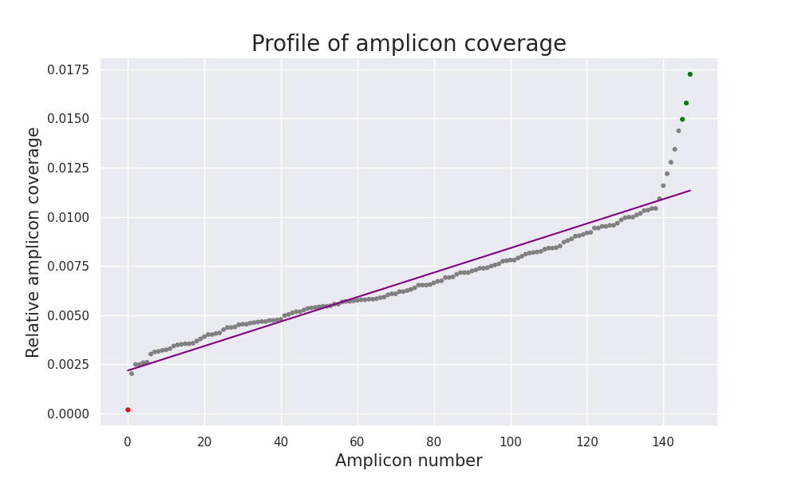
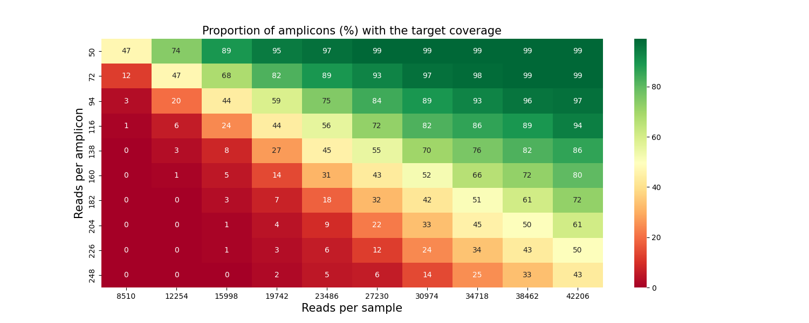

# Pipeline for a targeted gene sequencing panel validation

## Motivation
**Targeted sequencing** is a rapid and cost-effective way to detect known and novel variants and is widely 
applied in medicine. The targeted panels include specific regions of the genome that are associated with 
a disease or phenotype of interest. By focusing only on key regions of interest, targeted gene panels 
help reduce sequencing time and simplify data analysis.
 
Targeted sequencing requires upfront selection and isolation of genes or regions of interest, typically 
by either **PCR amplification** or hybridization-based capture methods. It should be recalled that not 
all regions of interest are suitable for analysis. It is important to be aware of the **analytical 
characteristics** and **limitations** when using targeted gene panels.

## Aim and tasks
The **aim** of the project is to develop a pipeline for validation of targeted gene sequencing panels. 
The main steps of the pipeline include a searching for undercovered and overcovered amplicons, searching 
for regions with low sequencing quality (LQRs), and generation tables for calculation of the required 
number of reads per sample. The following **tasks** were set in order to achive the goal:
* Get acquainted with the process of a primer panel design;
* Get acquainted with methods, tools and reference materials for assessing the NGS data quality;
* Build a Snakemake pipeline;
* Test the pipeline on different designed targeted gene sequencing panels

## Conclusion
The Snakemake pipeline for a targeted gene sequencing panel validation united several Python scripts
(described below), as well as sequtils and a cwl script for amplicon coverage analysis. 
Obtained pipeline was successfully tested on several panels.

## Installation

### Snakemake Installation via Conda/Mamba
This is the recommended way to install Snakemake, because it also enables Snakemake to handle software 
dependencies of your workflow. Mamba installation is recommended:

```commandline
conda install -n base -c conda-forge mamba
```
Snakemake can be installed with all goodies needed to run in any environment and for creating interactive reports via

```commandline
conda activate base
mamba create -c conda-forge -c bioconda -n snakemake snakemake
```

from the Bioconda channel. This will install snakemake into an isolated software environment, that has to be activated with

```commandline
conda activate snakemake
snakemake --help
```

### Requirements

* awk==5.1.0
* cat==8.32
* openjdk==11.0.13
* python==3.9.12
* samtools==1.11
* snakemake==7.3.8
* matplotlib==3.5.1
* seaborn==0.11.2
* pandas==1.4.0
* scikit-learn==1.0.2
* numpy==1.22.3
* sequtils

### Requirements installation 

Install dependencies:

```pip install -r requirements.txt```

## Usage

### 1. Script for searching for under- and overcovered amplicons

This script is looking for under- and overcovered amplicons. It needs the coverage analysis results (VariFind or/and OncoScope). Using linear regression, the script predicts the relative amplicon coverage. Then the ratio of observed and predicted coverage is counting. In the case the ratio is less then 0.5 (set as a parameter), the amplicon is considered to be undercovered.

When running the script you will be requested to specify the path to VariFind or/and OncoScope coverage analysis results, output files directory, threshold for linear regression coefficient, threshold ratio for under- and overcovered amplicons, and width and height of linear regression plot.
When the script completed, we received a file with under- and overcovered amplicons, as well as a linear regression plot for analysed amplicons (in a picture below undercovered amplicons are marked in red, overcovered - in green).



### Input
```commandline
-i, --input_files: The path to TSV file(s), containing coverage analysis results (VariFind, OncoScope)
-d, --output_dir: The path to the output files directory
-t, --threshold: Threshold for R2 in linear regression (default: 0.85)
-u, --under_ratio: The ratio of observed to predicted relative coverage for undercovered amplicons (default: 0.5)
-o, --over_ratio: The ratio of observed to predicted relative coverage  for overcovered amplicons (default: 1.3)
-w, --figure_width: The width of the linear regression plot (default: 10)
-e, --figure_height: The height of the linear regression plot (default: 6)
```

### Run script

```commandline
python3  amplicon_coverage.py -i <input_files> -d <output_files_dir> -t 0.85 -u 0.5 -o 1.3 -w 10 -e 6
```

### Output

```commandline 
<TSV-file_prefix>_undercovered_amplicons.txt 
<TSV-file_prefix>_overcovered_amplicons.txt
<TSV-file_prefix>_amplicon_coverage_scatterplot.png
```

### 2. Script for selecting the subsampling parameters

This script calculates the parameters for BAM subsampling - the percentage of reads that should remain in the initial BAM file after subsampling, and saves the result in a JSON file.

The script also checks that the minimum number of reads per amplicon does not exceed the maximum number of reads per amplicon and that the multiplication of the maximum number of reads per amplicon and the number of amplicons in the panel does not exceed the number of reads in the BAM file.

When running the script you will be requested to select the range of the number of reads per amplicon (the first and last points), the number of points, the number of amplicons in the panel, and the number of mapped reads in a BAM file. 

### Input
```commandline
-f, --first_point: The first point among numbers of reads per amplicon
-l, --last_point: The last point among numbers of reads per amplicon
-p, --points: The number of points (numbers of reads per amplicon)
-a, --amp_number: The number of amplicons in a panel
-m, --mapped_reads: The number of mapped reads in a BAM file
-o, --output_dir: The path to output files
```
### Run script

```commandline
python3  subsampling_params.py -f <first_point> -l <last_point> -p <number_of_points> -a <number_of_amplicons> -m <number_of_mapped_reads> -o <output_files_dir>
```

### Output

```commandline 
subsampling_params.json 
```


### 3. Script for counting low quality regions (LQRs)

This script extracts low quality regions (LQR) from 'sequtils regions' results and writes these regions into a new BED-file with 'LQR' suffix. Quality value (QV) corresponds to the sequtils quality corrected coverage (QCC) threshold, i.e. 2^n.

When running the script you will be requested to select quality threshold, input directory with BED files and the folder for putput files.

### Input
```commandline
-q, --quality_threshold: The sequencing quality threshold
-i, --input_dir: The path to input BED files directory containing the output of sequtils.jar
-o, --output_dir: The path to output files directory
```
### Run script

```commandline
python3 LQR_counting.py -q <quality_value> -i <input_files_dir> -o <output_files_dir>
```

### Output

```commandline 
<BAM_file_prefix>_sub<subsampling_index>_LQR.bed 
```


### 4. Script for plotting the percentage of LQRs for each point (number of reads per amplicon)

This script plots the percentage of LQRs for each selected points (the number of reads per amplicon). To run, it needs a TXT file that contains the proportion of positions that belong to the region with low sequencing quality for each point.

When running the script you will be requested to select the path to input TXT file, output file directory, the range of the number of reads per amplicon (the first and last points), the number of points, and the width and height of LQR percentage plot.

The script also checks that the minimum number of reads per amplicon does not exceed the maximum number of reads per amplicon and that the multiplication of the maximum number of reads per amplicon and the number of amplicons in the panel does not exceed the number of reads in the BAM file.

When the script completed, we received a PNG file, containing the plot of LQR proportion in target regions. 


### Input
```commandline
-f, --first_point: The first point among numbers of reads per amplicon
-l, --last_point: The last point among numbers of reads per amplicon
-p, --points: The number of points (numbers of reads per amplicon)
-a, --amp_number: The number of amplicons in a panel
-m, --mapped_reads: The number of mapped reads in a BAM file
-i, --input_file: The path to input TXT file, proportion of positions that belong to the region with low sequencing quality for each point
-o, --output_dir: The path to output files
-w, --figure_width: The width of the LQR plot (default: 10)
-e, --figure_height: The height of the LQR plot (default: 6)
```

### Run script

```commandline
python3 LQR_proportion_plot.py -i <input_file> -o <output_file_dir> -f <first_point> -l <last_point> -p <number_of_points> -a <number_of_amplicons> -m <number_of_mapped_reads> -w 10 -e 6
```

### Output

```commandline 
LQR_proportion_plot.png
```


### 5. Script for creating the table for calculating the number of reads per sample

This script creates the table for selection the number of reads per sample according to amplicon coverage. Row names correspond to the number of reads per amplicon, column names - to the number of reads per sample (taking into account the correction coefficient, which is set as a parameter). This table allows the user to choose an appropriate number of reads per sample and calculate how many samples could be multiplexing on a sequencing run.

When running the script you will be requested the input TVS files, output file directory, the range of the number of reads per amplicon (the first and last points), the number of points, the number of amplicons in a panel, and a correction coefficient.

The script also checks that the minimum number of reads per amplicon does not exceed the maximum number of reads per amplicon and that the multiplication of the maximum number of reads per amplicon and the number of amplicons in the panel does not exceed the number of reads in the BAM file.

When the script completed, we received a TXT file, containing the proportion of amplicons (%) with the target coverage.

```commandline
-t, ---tsv_files: The list of tsv files, obtained after coverage analysis"
-f, --first_point: The first point among numbers of reads per amplicon
-l, --last_point: The last point among numbers of reads per amplicon
-p, --points: The number of points (numbers of reads per amplicon)
-a, --amp_number: The number of amplicons in a panel
-m, --mapped_reads: The number of mapped reads in a BAM file
-с, --correction: The correction coefficient for the number of reads per sample (default: 15)
-o, --output_dir: The path to output files
```
### Run script

```commandline
python3 coverage_table.py -o <output_file_dir> -t <list_of_tsv_files> -f <first_point> -l <last_point> -p <number_of_points> -a <number_of_amplicons> -m <number_of_mapped_reads> -c 15
```

### Output

```commandline 
coverage_table.txt
```


### 6. Script for visualization of the table for calculating the number of reads per sample

This script creates the heatmap of proportions of amplicons (%) with the target coverage. To run, it needs a TXT file containing the proportion of amplicons (%) with the target coverage.

When running the script you will be requested to select the path to input TXT file, output file directory, and the width and height of a heatmap. When the script completed, we received a PNG file, containing the plot of LQR proportion in a target region. 



```commandline
-i, --input_file: The path to input TXT file, containing the table for calculating the number of reads per sample
-o, --output_dir: The path to output files
-w, --figure_width: The width of the heatmap (default: 15)
-e, --figure_height: The height of the heatmap (default: 6)
```
### Run script

```commandline
python3 heatmap_coverage.py -i <input_file> -o <output_file_dir> -w 15 -e 6
```

### Output

```commandline 
heatmap_coverage.png
```


## Snakemake pipeline

To run the snakemake pipeline, you need to put the BAM file, BED files with target regions and amplicons and TSV file with coverage analysis results in a working directory and specify the path to this folder in the configuration file. You also need to enter the prefix of the BAM and TSV files, and the name of BED file (with extension), specify the path to sequtils.jar and other params. 

Pipeline output files will be replaced to the OUTPUT_FILES folder.

### Pipeline input:
```commandline
--snakefile: The path to Snakefile
--configfile: The path to YAML configuration file
--cores: Specify the maximum number of CPU cores to be used at the same time (enter a number of cores "--cores N" or do not enter anything "--cores") 
```
### Run pipeline

```commandline
snakemake --snakefile panel_validation.snakefile --configfile config_panel_validation.yaml --cores
```

### Pipeline output

```commandline
<TSV-file_prefix>_undercovered_amplicons.txt 
<TSV-file_prefix>_overrcovered_amplicons.txt
<TSV-file_prefix>_amplicon_coverage_scatterplot.png
LQR_proportion_plot.png
coverage_table.txt 
heatmap_coverage.png 
```
